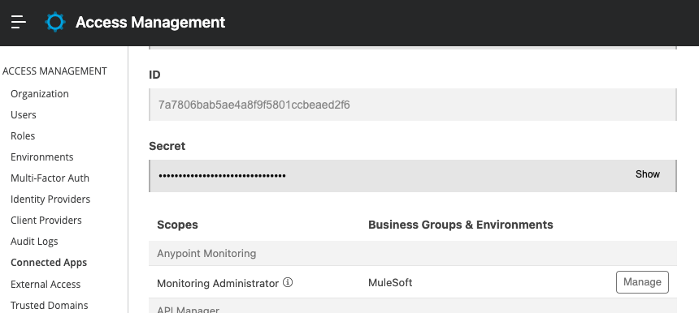

# Anypoint Monitoring - Creating Alerts to Multiple CH2.0 Applications programatically

In Runtime manager, for CloudHub 2.0 applications only the **Deployment success** and **Deployment failure** alerts definitions are supported. Also in Runtime Manager, while creating an alert in Runtime manager, we could choose multiple applications to apply the alert to. 

## **Important** - Things to consider before creating Alerts programatically using Platform APIs
-  Anypoint Monitoring Platform API definitions are not offically defined and published by Mulesoft. The APIs defined below for Anypoint Monitoring are created using the browser's network calls introspection.
-  Do not build and run an application that could execute numerous platform api calls to the mulesoft anypoint platform organization. For security reasons, there are some Rate Limiting policies at an organizational level and it could impact other important applications or deployments. 
- It is highly recommended to design the alerts that needs to be applied to the applications. The goal is to have the right alerting threshholds and rules inorder to get get alerted in a timely and proactive maner rather than numerous alerts that loose the significance. 

## prerequisites
-   Create or update ConnectedApps with Monitoring Administrator scope. 

- Using the ConnectedApps client_id and client_secret, get the {access_token} using the following API to execute the platform APIs 

        curl --location 'https://anypoint.mulesoft.com/accounts/api/v2/oauth2/token' \
            --header 'Content-Type: application/json' \
            --data '{
                "client_id"     : "7a7806bab5ae4a8f9f5801ccbeaed2f6",
                "client_secret" : "3375Ed5200254F87AfCcA0e8bd708a5F",
                "grant_type"    : "client_credentials"
            }'

- Have the following information 
    - Anypoint Master Org Id {anypoint.master.org.id}
    - Anypoint Org Id {anypoint.org.id}
    - Environment Id {anypoint.environment.id}
    - CH2.0 Private Space cluster Id {anypoint.ch2.cluster.id}

You could use anypoint.mulesoft.com User Interface or the following platform APIs to gather the information mentioned above. 
- API to get all environment Ids with in the {anypoint.org.id}

        curl --location 'https://anypoint.mulesoft.com/accounts/api/organizations/{anypoint.org.id}/environments' \
        --header 'Authorization: Bearer {access_token}'

- Get all CloudHub 2.0 Applications that are deployed. You could get both CloudHub 2.0 Application Id, Application Name and target Id (Namespace Id) using the following API 

        curl --location 'https://anypoint.mulesoft.com/amc/application-manager/api/v2/organizations/{anypoint.org.id}/environments/{anypoint.environment.id}/deployments' \
        --header 'Authorization: Bearer {access_token}'

You could use [Mulesoft's Developer Portal](https://anypoint.mulesoft.com/exchange/portals/anypoint-platform/) to explore other Platform related APIs 

## API Call to create Anypoint Monitoring Alert (as of March 2023)

Below is the API example of creating Anypoint Monitoring Alert for an CH2.0 Application. This is just a reference for alerting when CPU Utilization is above 80% for atleast last 5 consecutive periods of 1 minutes. You need to updated the values with in {} and also change the Alert Notification details as required. 

curl --location 'https://anypoint.mulesoft.com/monitoring/api/v2/organizations/{anypoint.org.id}/alerts' \
--header 'Authorization: Bearer {access_token}' \
--data-raw '{
    "alertType": "basic",
    "alertName": {Alert Name},
    "masterOrganizationId": {anypoint.master.org.id},
    "organizationId": {anypoint.org.id},
    "resource": {
      "type": "application",
      "organizationId": {anypoint.org.id},
      "environmentId": {anypoint.environment.id},
      "deploymentType": "RTF",
      "clusterId": {anypoint.ch2.cluster.id},
      "appId": {appName}
    },
    "alertViolationInterval": 5,
    "aggregationInterval": 1,
    "aggregationFunction": "mean",
    "metricType": "cpu_utilization" ,
    "properties": [
      {
        "name": "operator",
        "value": "above"
      },
      {
        "name": "threshold",
        "value": "0.8"
      }
    ],
    "alertNotifications": [
      {
        "recipients": [
          {emails}
        ],
        "subject": "${severity}: ${resource} ${condition}",
        "message": "Hello,\nYou are receiving this alert because:\nThe resource ${resource} has ${condition} of ${value} at ${timestamp}.\nThe resource has reached the threshold based on ${condition} defined by alert condition of ${operator} ${threshold} for ${period}.\n\nEnvironment: ${environment}\n${dashboardLink}\n${alertLink}",
        "type": "email"
      }
    ],
    "severity": "warning"
  }'

## Creating Alerts for Multiple Applications 

You could design and create an application or script to loop through the applications and alerts and invoke API to create an alert.  For example, If you need to create 3 alerts for 5 applications then you need to create total of 15 alerts. 

Use the Mulesoft application that is mentioned here as a reference only.  This is developed only for logic demonstration purpose and this is not production ready code does not include Exception Handling, Error Handling, Unit Testing etc... 

## Understanding the Sample Demo Application to create multiple alerts 

## Points to Consider
1. The following properties needs to be updated either in local/local.properties or dev/dev.properties based on the environment variable. 
        ##Anypoint Org Configurations 
        anypoint.master.org.id = 
        anypoint.org.id = 
        anypoint.environment.id = 
        anypoint.ch2.cluster.id = 

2. Create and Design the Alerts Payload.  The Alerts creation Payload should consist of "Metric Details Array", "Alert details Array" and the Applications Array. Refer to the Sample payload @src/test/resources/sample-requests/POST-alerts-body.json. 
3. Update the secure properties with the ConnectedApp id and secret.  Make sure you modify the Global property for "secure.key" and generate the secure keys for ConnectedAPP Client ID and Client Secret.  (ConnectedAPP should have Anypoint monitoring Scope)
4. The Sample Application have the following APIs 
- Get Current Alerts - GET http://{hosturl}:8081/alerts  - Get current Anypoint Monitoring Alerts. Modify the Dataweave to display the results as required 
- Create Monitoring Alerts - POST  http://{hosturl}:8081/alerts. You could either send the payload as Body or configure the "alerts.config.file" with the Alerts file. 
- Delete Monitoring Alerts - DELETE http://{hosturl}:8081/alerts - Body will have array of strings. Each string value is an Alert ID. 
- Get CH2.0 Application Details - GET http://{hosturl}:8081/applications/ch2

**Notes** 
This is only for POC and can be used for reference only. 

